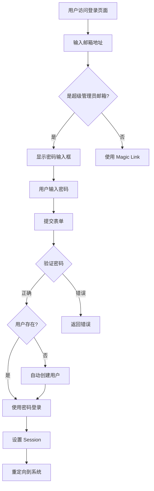

# 完成总结：内置超级管理员功能

## 🎉 功能已完成

我已经成功为你实现了**内置超级管理员账号**功能！

## ✅ 实现的功能

### 1. 核心功能
- ✅ 邮箱+密码登录
- ✅ 自动创建超级管理员账号
- ✅ 开发和生产环境都可用
- ✅ ERP 和 MES 应用都支持
- ✅ 智能显示密码输入框（仅当输入超级管理员邮箱时）

### 2. 安全特性
- ✅ 密码不暴露给前端
- ✅ 后端验证密码
- ✅ 支持 Rate Limiting
- ✅ 使用 Supabase Auth 加密存储

### 3. 用户体验
- ✅ 无需配置邮件服务
- ✅ 首次登录自动创建账号
- ✅ 跨环境使用统一账号
- ✅ 紧急情况快速访问

## 📝 快速开始

### 1. 配置环境变量

编辑 `.env` 文件：

```bash
# 内置超级管理员账号
SUPER_ADMIN_EMAIL="admin@yourcompany.com"
SUPER_ADMIN_PASSWORD="YourSecurePassword123!"
```

### 2. 重启服务

```bash
# 开发环境
crbn dev

# 或生产环境
docker-compose restart
```

### 3. 登录测试

1. 访问 `http://localhost:4000/login`
2. 输入邮箱：`admin@yourcompany.com`
3. 密码输入框自动出现
4. 输入密码：`YourSecurePassword123!`
5. 点击登录
6. 首次登录完成 Onboarding 流程

## 📂 修改的文件

### 核心文件（5 个）

1. **`packages/env/src/index.ts`**
   - 添加 `SUPER_ADMIN_EMAIL` 和 `SUPER_ADMIN_PASSWORD` 环境变量
   - 暴露 `SUPER_ADMIN_EMAIL` 给前端

2. **`packages/auth/src/validators.ts`**
   - 在 `magicLinkValidator` 中添加可选的 `password` 字段

3. **`apps/erp/app/routes/_public+/login.tsx`**
   - 添加超级管理员登录逻辑（后端）
   - 添加密码输入框显示逻辑（前端）

4. **`apps/mes/app/routes/_public+/login.tsx`**
   - 添加超级管理员登录逻辑（后端）
   - 添加密码输入框显示逻辑（前端）

5. **`apps/erp/app/root.tsx`**
   - 暴露 `SUPER_ADMIN_EMAIL` 给前端

### 配置文件（2 个）

6. **`.env`**
   - 添加超级管理员配置示例

7. **`.env.example`**
   - 添加超级管理员配置模板

## 📚 创建的文档

### 1. 详细文档

- **`内置超级管理员账号-使用指南.md`** - 完整使用指南
  - 功能说明
  - 配置方法
  - 使用步骤
  - 工作原理
  - 安全建议
  - 常见问题（Q&A）

### 2. 快速参考

- **`快速参考-超级管理员登录.md`** - 快速参考卡片
  - 2 步配置
  - 3 步登录
  - 常见问题

### 3. 技术文档

- **`功能实现-内置超级管理员.md`** - 技术实现细节
  - 实现原理
  - 代码结构
  - 工作流程
  - 安全特性

### 4. 总结文档

- **`完成总结-内置超级管理员功能.md`** - 本文档

## 🔐 安全建议

### 开发环境

```bash
# 可以使用简单密码
SUPER_ADMIN_EMAIL="admin@dev.local"
SUPER_ADMIN_PASSWORD="admin123"

# 也可以保留 DEV_BYPASS_EMAIL
DEV_BYPASS_EMAIL="admin@example.com"
```

### 生产环境

```bash
# ⚠️ 必须删除 DEV_BYPASS_EMAIL
# DEV_BYPASS_EMAIL="admin@example.com"

# 使用强密码（20+ 位）
SUPER_ADMIN_EMAIL="admin@yourcompany.com"
SUPER_ADMIN_PASSWORD="Xy9$mK2#pL8@vN4&qR7!wT3%"
```

### 密码要求

生产环境密码必须：
- ✅ 至少 12 位（推荐 20+ 位）
- ✅ 包含大写字母
- ✅ 包含小写字母
- ✅ 包含数字
- ✅ 包含特殊字符
- ✅ 不使用常见密码
- ✅ 不使用个人信息

## 🎯 使用场景

### 1. 首次部署生产环境

```
部署服务器 → 配置超级管理员 → 访问登录页面 → 输入邮箱密码 → 完成 Onboarding → 添加其他管理员
```

### 2. 紧急访问系统

```
邮件服务故障 → 无法使用 Magic Link → 使用超级管理员登录 → 修复问题
```

### 3. 跨环境测试

```
开发环境测试 → 使用相同账号 → 测试环境验证 → 生产环境部署
```

## 🔄 工作流程



## 📊 对比表格

| 特性 | 超级管理员 | DEV_BYPASS_EMAIL | Magic Link | OAuth |
|------|-----------|-----------------|-----------|-------|
| **适用环境** | 开发+生产 | 仅开发 | 开发+生产 | 开发+生产 |
| **需要密码** | ✅ 是 | ❌ 否 | ❌ 否 | ❌ 否 |
| **需要邮件服务** | ❌ 否 | ❌ 否 | ✅ 是 | ❌ 否 |
| **自动创建用户** | ✅ 是 | ✅ 是 | ❌ 否 | ✅ 是 |
| **安全性** | ⭐⭐⭐⭐ | ⭐⭐ | ⭐⭐⭐⭐⭐ | ⭐⭐⭐⭐⭐ |
| **使用场景** | 首次部署、紧急访问 | 本地开发 | 普通用户 | 企业用户 |
| **配置复杂度** | 简单 | 简单 | 中等 | 复杂 |

## ❓ 常见问题

### Q1: 忘记超级管理员密码怎么办？

**方法 1：修改 .env**
```bash
SUPER_ADMIN_PASSWORD="NewPassword123!"
# 重启服务
crbn dev
```

**方法 2：Supabase Dashboard**
1. 登录 Supabase Dashboard
2. Authentication > Users
3. 找到超级管理员
4. Reset Password

### Q2: 可以有多个超级管理员吗？

不可以。但可以：
1. 使用超级管理员登录
2. Users > Employees > New Employee
3. 设置角色为 "Admin" 或 "Owner"

### Q3: 密码输入框不显示？

确保：
- 输入的邮箱与 `SUPER_ADMIN_EMAIL` 完全一致
- 已重启服务
- 浏览器已刷新（Ctrl+Shift+R）

### Q4: 生产环境需要删除 DEV_BYPASS_EMAIL 吗？

**是的！** 生产环境必须删除：
```bash
# 生产环境 .env
# DEV_BYPASS_EMAIL="admin@example.com"  # 必须注释掉！

SUPER_ADMIN_EMAIL="admin@yourcompany.com"
SUPER_ADMIN_PASSWORD="SecurePassword123!"
```

### Q5: 超级管理员和普通管理员有什么区别？

**权限上：** 完全相同，都是 Owner 角色

**登录方式：**
- 超级管理员：邮箱+密码
- 普通管理员：Magic Link 或 OAuth

**创建方式：**
- 超级管理员：配置环境变量，首次登录自动创建
- 普通管理员：通过邀请加入

## ✅ 部署检查清单

部署到生产环境前，确保：

- [ ] 已设置 `SUPER_ADMIN_EMAIL`
- [ ] 已设置强密码 `SUPER_ADMIN_PASSWORD`（20+ 位）
- [ ] 已删除或注释 `DEV_BYPASS_EMAIL`
- [ ] 已测试超级管理员登录
- [ ] 已完成 Onboarding 流程
- [ ] 已添加其他管理员账号
- [ ] 已启用 HTTPS
- [ ] 已配置防火墙（可选）
- [ ] 已设置监控和日志
- [ ] 已备份环境变量

## 🧪 测试步骤

### 1. 开发环境测试

```bash
# 1. 配置 .env
SUPER_ADMIN_EMAIL="test@example.com"
SUPER_ADMIN_PASSWORD="Test123!"

# 2. 重启服务
crbn dev

# 3. 测试 ERP
# 访问 http://localhost:4000/login
# 输入 test@example.com
# 输入 Test123!
# 确认登录成功

# 4. 测试 MES
# 访问 http://localhost:4001/login
# 重复上述步骤
```

### 2. 生产环境测试

```bash
# 1. 配置生产环境 .env
SUPER_ADMIN_EMAIL="admin@yourcompany.com"
SUPER_ADMIN_PASSWORD="Xy9$mK2#pL8@vN4&qR7!"

# 2. 部署到生产
docker-compose up -d

# 3. 测试登录
# 访问 https://your-domain.com/login
# 输入超级管理员邮箱和密码
# 确认登录成功
```

## 📖 相关文档

### 用户文档
- `内置超级管理员账号-使用指南.md` - 完整使用指南
- `快速参考-超级管理员登录.md` - 快速参考

### 技术文档
- `功能实现-内置超级管理员.md` - 技术实现细节

### 其他相关文档
- `生产部署-初始用户和登录.md` - 生产部署指南
- `用户权限和邀请流程.md` - 权限系统说明
- `快速参考-用户管理.md` - 用户管理参考

## 🎓 下一步

### 1. 测试功能

```bash
# 在开发环境测试
crbn dev
# 访问 http://localhost:4000/login
# 测试超级管理员登录
```

### 2. 添加其他管理员

登录后：
```
Users > Employees > New Employee
→ 填写信息
→ 设置角色为 Admin
→ 发送邀请
```

### 3. 配置生产环境

```bash
# 修改 .env 使用强密码
SUPER_ADMIN_PASSWORD="Xy9$mK2#pL8@vN4&qR7!wT3%"

# 删除开发配置
# DEV_BYPASS_EMAIL="admin@example.com"
```

### 4. 部署到生产

```bash
# 构建镜像
docker-compose build

# 启动服务
docker-compose up -d

# 测试登录
# 访问 https://your-domain.com/login
```

## 💡 提示

### 密码管理

推荐使用密码管理器生成和存储超级管理员密码：
- 1Password
- LastPass
- Bitwarden
- KeePass

### 定期更换密码

建议每 3-6 个月更换一次超级管理员密码：
```bash
# 1. 生成新密码
# 2. 更新 .env
SUPER_ADMIN_PASSWORD="NewSecurePassword123!"
# 3. 重启服务
docker-compose restart
```

### 监控登录

定期检查 Supabase Auth 日志：
1. 登录 Supabase Dashboard
2. Authentication > Logs
3. 查看登录记录
4. 监控异常登录尝试

## 🎉 总结

你现在拥有了一个完整的内置超级管理员功能：

✅ **配置简单** - 只需 2 个环境变量
✅ **使用方便** - 邮箱+密码登录
✅ **安全可靠** - 密码加密存储
✅ **跨环境支持** - 开发和生产都可用
✅ **自动创建** - 首次登录自动创建账号
✅ **文档完善** - 详细的使用和技术文档

**解决的问题：**
- ✅ 生产环境首次登录
- ✅ 无需配置邮件服务
- ✅ 开发和生产使用统一账号
- ✅ 紧急情况快速访问

**下一步：**
1. 在开发环境测试功能
2. 配置生产环境强密码
3. 部署到生产服务器
4. 使用超级管理员登录
5. 添加其他管理员

有任何问题随时问我！🚀
